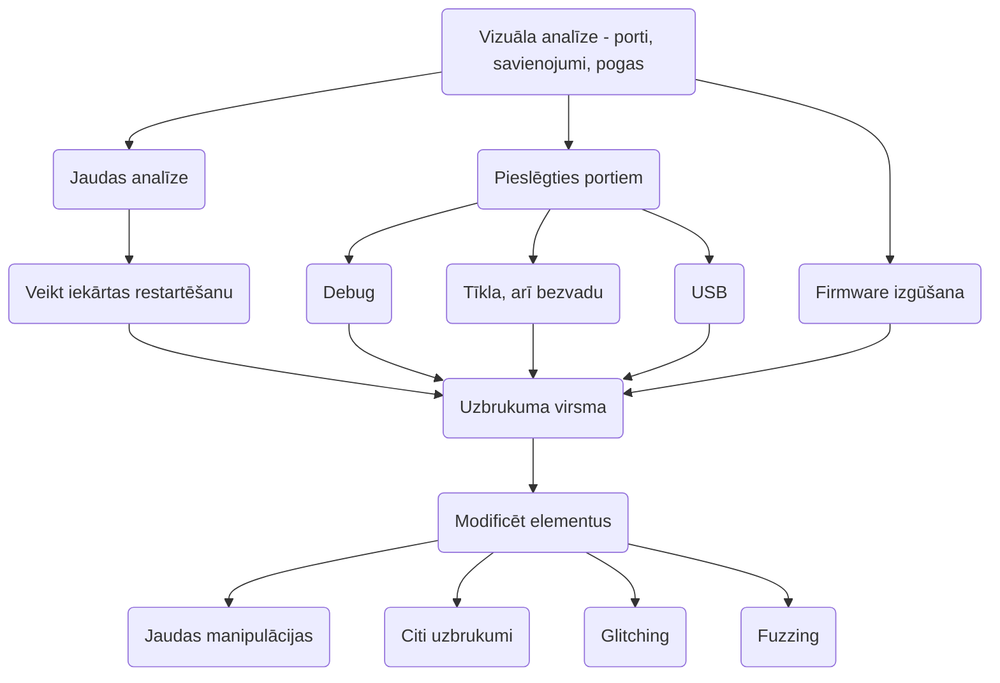

> Process, kurā laikā tiek veiktas manipulācijas vai modifikācijas fiziskai iekārtai.

- Atmiņas izgūšana
- Protokolu ievainojamības
- Klupēšana (*glitching*)

## Atmiņas izmete (*flash dump*)
- Atlodēt čipu in pielodēt citā iekārtā
- Pievienot vadus pie pins un izmantot programmatūru (bieži ir specifiska priekš katra čipa veida)
- Izmantot atkļūdotāja savienojumu un programmatūru, piemēram pyOCD
[Tutorial](https://www.blackhillsinfosec.com/dumping-firmware-with-the-ch341a-programmer/)

## [[Rīki]]
- [[PyOCD]]
- [[Wireshark]] - mak klausīt USB
- [[QEMU]]
- [[SPI flash]]
## Uzdevumu risināšanas algoritms
- Vizuāla analīze - identificēt komponentes, portus, pins, utt.
- Pieslēgties portiem - UART, JTAG, SWD, USB
- Izveidot bezvadu savienojumu, ja nepieciešams - Wi-Fi, Bluetooth, RFID, NFC
- Analizēt iekārtas ieslēgšanās procesu - mēģināt iegūt piekļuvi *bootloader*
- Izgūt *firmware* - piemēram ar *[[SPI flash]]*
- Testēt ar nepareizi formatētu ievadi - *fuzzing*

