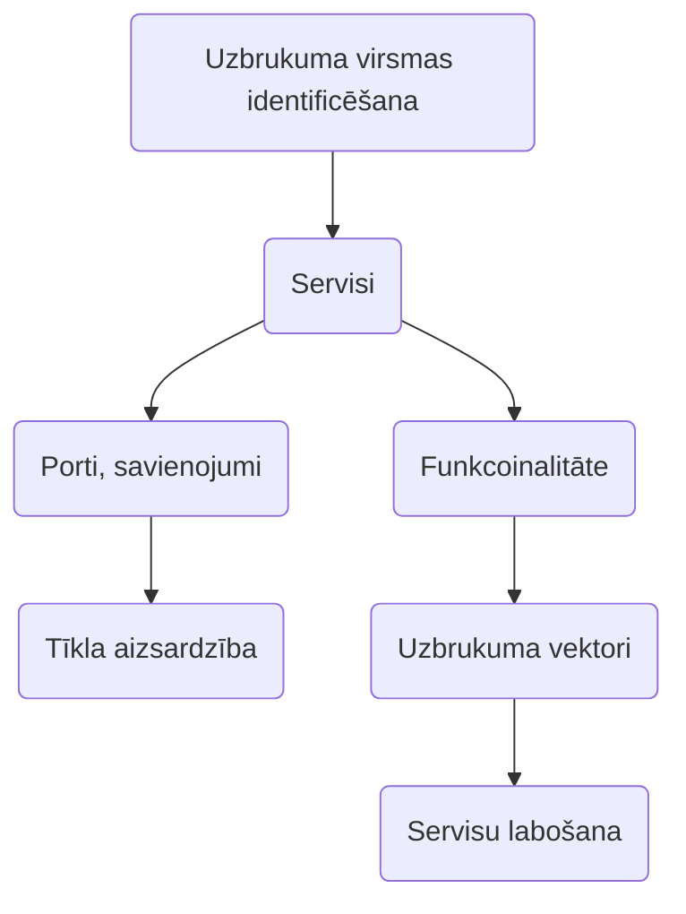
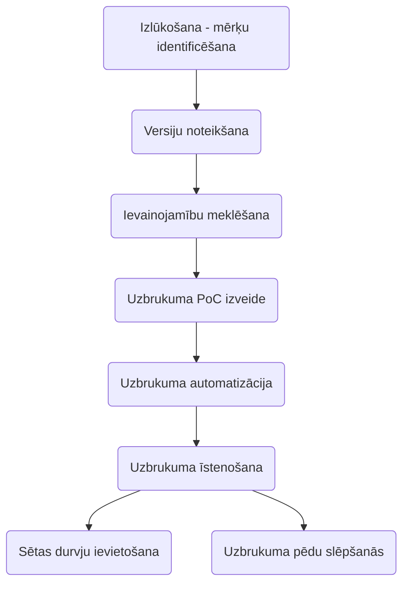

## [[Rīki]] (komandas)
### Diska satura analīze
- [[find]]
	- `mtime`
	- `perm`
* [[md5sum]] / [[sha1sum]] ([Check file](https://www.virustotal.com/gui/home/upload))
* [[cron]] / [[at]] - scheduler 
* [[iotop]]
* `/etc/init.d/` un `/etc/rcN.d/` - parāda servisus, kas sāk strādāt uzreiz, kad mašīna ieslēdzas
* `/etc/shadow` / `/etc/passwd` - parāda lietotājus un paroles
* [[chattr]] `+a +i` (aizsardzības) - change attributes (`+a` - append only)

### Procesu analīze
- [[ps]] - process list (`auxfw`)
- [[pstree]]
- [[lsof]] / [[fuser]]- list opened files
- [[Pspy]]
- [[inotify]] - proactive monitoring
* [[strace]] `-p {process}`

### Tīkla analīze
* [[ss]] `lp`
* [[netstat]] `-atpln[t]`
* [[iftop]] - interface top
* [[tcpflow]]
* [[tcpdump]] +[[Wireshark]] [Workshop video](https://www.youtube.com/watch?v=HtNvcaqJHPw)
## Ļaundabīgi procesi
- Pārbaudīt procesu izsaucošās programmas jjaucējsummu (*hash*) datubāzēs
- Atrast failu, kas iniciē procesu
- Saprast, kādus savienojumus process veido
- Saprast, ko dara process
- `kill -9 PID`

## Ļaundabīgi savienojumi
- Idenificēt uz kurieni iziet savienojums
- Identificēt, kurš process ir iniciējis savienojumu
- `tcpkill -i eth0 port [number]`
- `tcpkill host [IP]`

## Žurnālfaili
* `/var/log/auth.log`
* `/var/log/cron.log`
* `'/var/log/syslog` / `/var/logdmesg`
* `/var/log/secure`
* `/var/lib.docker`

## Firewall
- Pārliecināties, ka ieslēgts
- Ieslēgt žurnalēšanu
- Iepazīties ar esošo [[iptables]]` -L -v -n`
- Ja pārāk sarežģīti [[ufw]], [[firewalld]]
- Zero trust
- Garantēti sliktie savienojumi:
	- **TARPIT**
	- **PSD** = packet scam detection

## 3 types of UI
- **CLI** = command line interface
- **GUI** = graphic user interface
- **TUI** = text user interface

## Automatizācija

> Ja vienu darbību plāno atkārtot vairāk kā dažas reizes - jāpadoma par automatizāciju
### [[Rīki]]
- [[Bash]]
- [[Python]]
- [[Ansible]]
- [[Elastic Agent]]
- [[Terminator]]

## Aizsardzības algoritms
- Kāda ir uzbrukuma virsma
- Kādi servisi ir jāaizsargā, kāda ir to funkcionalitāte
- Kuri savienojumi un porti ir nepieciešami
- Kādi ir potenciālie uzbrukuma vektori servisiem
- Ieviest tīkla aizsardzību
- Veikt servisu *patching*

## Uzbrukums - piekļuves ieguve
- Noklusējuma paroles
- Ievainojamas versijas
- Nepilnīgi ieviesta autemtifikāija
### Rīki
- [[nmap]]
- [[Metasploit]]
- [[pwntools]]
- etc
## Piekļuves ieguve un citas darbības
- Identificēt sasniedzamos servisus, portus
- Noteikt ievainojamības
- Veikt ekspluatāciju
- Nodrošināt sev sētas durvis

## Uzbrukuma algoritms
- Izlūkošana - mērķu identificēšana
- Serviju versiju noteikšana
- Ievainojamību meklēšana
- Uzbrukuma PoC izveide
- Uzbrukuma automatizācija
- Uzbrukuma īstenošana
- Pēdu slēpšana
- Ja iespējams - sētas durvju ievietošana

`/var/log` ... `sudo su`
`cat auth.log | less`

`htop`

`find . -mtime +1725033600`