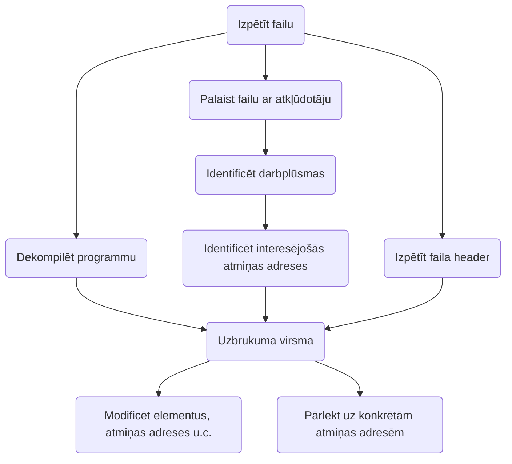

> Bināro failu modifikācija vai ievainojamību izmantošana, lai iegūtu kontroli pār programmu.

## Jēdzieni
- [[Registers]]
- The Stack
- Global Offset Table (GOT)
- Buffer
	- Buffer over
- Binary Security
	- No eXecute (NX)
	- Address Space Layout Randomization (ASLR)
	- Stack Canaries
	- Relocation Read-Only ()

## [[Stack]]
> Abstrakts datu tips, kas kalpo kā elementu kolekcija ar divām galvenajām operācijām: `Push` , kas kolekcijai pievieno elementu, un `Pop`, kas noņem pēdējo pievienoto elementu.

![[Pasted image 20240827112752.png]]

![[Pasted image 20240827112800.png]]
![[Pasted image 20240827112808.png]]

## GOT
> Ir saraksts no sistemas gatavam funkcijas.

## Buffer
> Programmas atmiņas apgabali, kuros informācija tiek uzgabāta īslaicīgi, kamēr tā tiek pārvietota

2 virknu glabašanas veidi
![[Pasted image 20240827113510.png]]

Buffer overflow
![[Pasted image 20240827113709.png]]

## Kaudze (heap)
> Kaudzes atmiņa ir datora atmiņas apgabals, ko izmanto dinamiskai objektu piešķiršanai izpildlaikā. Tas ir dinamisks atmiņas apgabals, kurā atmiņas bloki tiek piešķirti 


![[Pasted image 20240827114559.png]]
## Aizsardzība
- Stack canaries (ielec papildus skaitlus pie Stack)
- GOT neparrakstība
- NX bits (No eXecute)
	- > Tehnoloģija, kas sadala virtuālo adrešu apgabalu divās daļās - dati un processora instrukcijas
	- Atzīme īpašas 
 * Address Space Layout Randomization (ASLR)
	 * Nejauši sakārto procesa galveno datu apgabalu adrestelpas pozīcijas, tostarp izpildāma faila bāzi un stack, heap un bibliotēku pozīcijas
	 * ![[Pasted image 20240827114208.png]]
	


## Format String Vulnerability
- Koda injekcijas ievainojamība, kas ļauj izvadīt datus caur `printf` formatēšanu
- [Description](https://owasp.org/www-community/attacks/Format_string_attack)
  ```c
#include  <stdio.h> 
void main(int argc, char **argv)
{
	// This line is safe
	printf("%s\n", argv[1]);

	// This line is vulnerable
	printf(argv[1]);
}
```
`%s`, `%n`
## Metodes
-  Return to
	- `ret2win` 
		- `pop rbp`, `ret` in Assembly
	* `ret2libc`
* Format strings
* Buffer overflow

## Uzdevumu risināšanas algoritms
1. Veikt programmas izpēti (skatīt [[Reverse engineering]])
2. Darbināt programmu ar atkļūdotāju
3. Izmantot rīkus, lai pārlektu uz nepieciešamajiem atmiņas apgabaliem
4. Modificēt atmiņas apgabalus, ja nepieciešams




