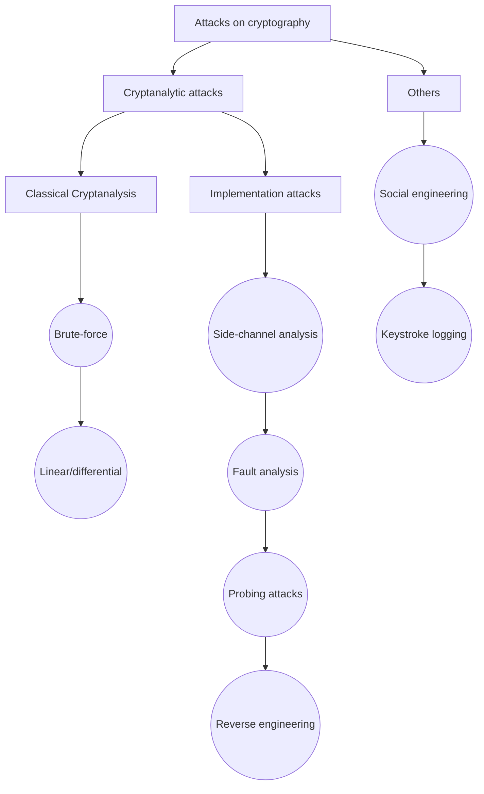
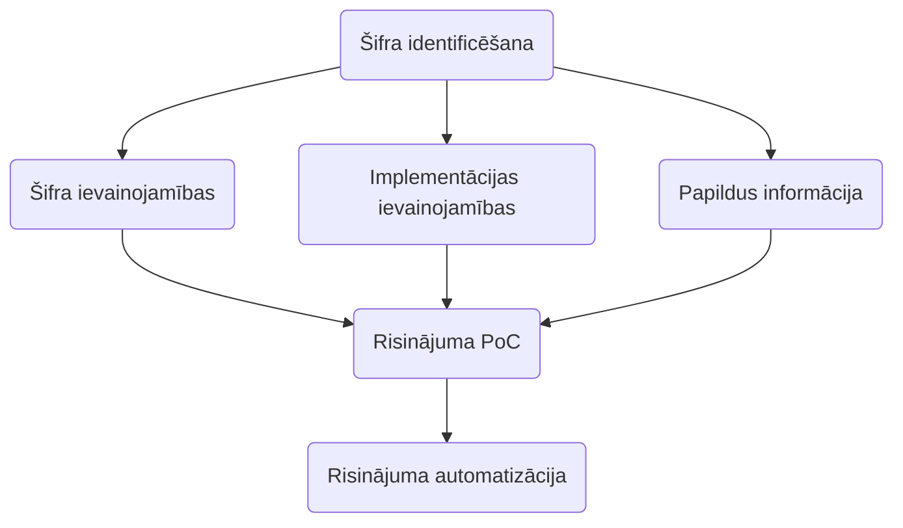

> Kriptogrāfija ir datu šifrēšana un atšifrēšana

- Simetriskā atslēgas šifrešana - viena atslēga
- Asimetriskā atslēgas šifrešana - vairākas atslēgas
---
- Strings uzbrukšana - katru simbolu atsevišķi
- Bloka šifrēšana - ņem vairākus simbolus pēc kārtas

## Bloku šifrēšana
Pastāv vairākas klases:
- *Electronic Code Book (ECB)* - 1. klases, mainot vietām, nekas nemainas
- *_ Block Cypher (CBC)* - bloku šifrešana ņem vērā iepriekšējo bloku rezultātus
## Kriptoanalīze
- Šifra identifikācija
- Reversā inženerija
- Pārlases uzbrukumi
- Blakus-kanālu (*side-channel*) uzbrukumi
- Šifra un šifra atslēgas noteikšana izmantojot zināmo nešifrētā teksta fragmentu
- Risinājuma automatizācija

> **One Time Pad** - nesalaužamais šifrējums, ja nav atslēgas. 

## Uzbrukumu metodes aizstavēšanas šifriem
1. Vārdnīcas metode - skatīties tieši pēc vardu formāta
	- `cat american-english | grep -E '^[a-zA-Z]{6}&' | grep -E '^(.)(.)(.)\2\3\2$'`
2. Ja zina, kādā valodā, tad skaitīt burtus, cik kādu atkartojas
## Rīki
- Tiešsaistes
	- [[CyberChef]]
	- [[dCode.fr]]
	- [[Crackstation]]
	- [Rumkin.com](https://rumkin.com/tools/cipher/)
- [[Cyphey]]
- [[RsaCtfTool]]
- [[PyCrypto]] & [[PyCryptodome]]
- [[OpenSSL]]

## Uzdevuma risināšanas algoritms
- Identificēt šifru
- Noteikt vai ir zināma papildus informācija, kas var palīdzēt salauzt šifrus
- Noteikt šifra vai implementācijas ievainojamības
- Ja iespējams, izveidot PoC potenciālajam risinājumam (piemēram, atšifrēt daļu no teksta)
- Automatizēt risinājumu

