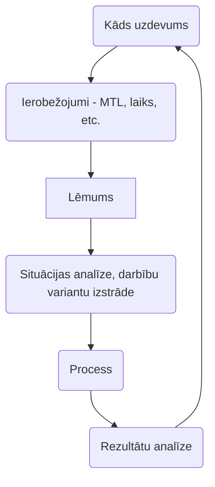

```mermaid
flowchart TB
A(Kāds uzdevums) --> B(Ierobežojumi - MTL, laiks, etc.)
B --> C[Lēmums]
C --> D(Situācijas analīze, darbību variantu izstrāde)
D --> E(Process)
E --> F(Rezultātu analīze)
F --> A
```

