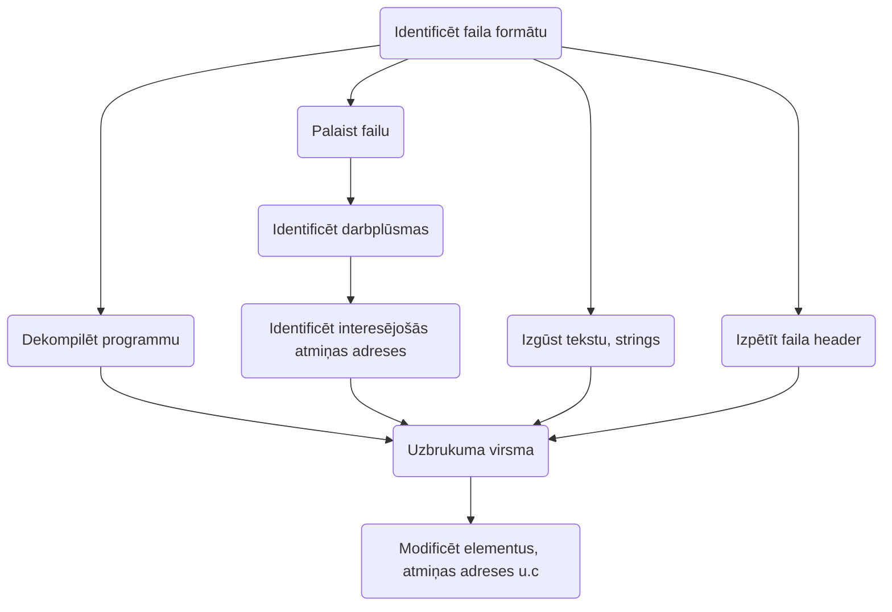

> Process, kurā programmatūra vai aparatūra tiek dekonstrēta, lai no tās iegūt papildis informāciju (bieži saistītu ar arhitektūru un implementāciju).

> `man ascii`

## [[Rīki]]
* [[GEF]]
* [[Ghidra]]
* [[Binary Ninja]]
* [[radare2]]
* [[IDA]]
* [[DnSPy]]
* [[binwalk]]
## Uzdevumu risināšanas algoritms
1. Analīze
2. Rīku izvēle
3. Dekompilācija, ja nepieciešams
4. Darbplūsmas, loģikas un mainīgo analīze
5. Modifikācija, ja nepieciešams
6. Rezultātu iegūšana

