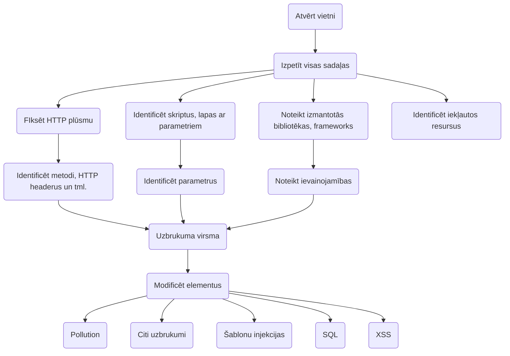

## Klienta puses ievainojamības
- HTML injekcijas
- JS injekcijas
- Atvērta pāradresācija
- CORS - ļauj piekļaut datiem citā domēnā
- Cross Site Script Inclusion (XSSI) - ieladēt scripts

> Example - "OWASP Juice Shop"
> browser > dev tools > network > request details > search api > add role to request
> `curl ... --raw_data{}` 

## Servera puses ievainojamības
- SQL injekcijas
- Template injekcijas (`{{2*2}})
- Komandu (rindas) injekcijas
- LDAP injekcijas
> Injekcija - iedot serverim komandu kā datus
- HTTP parametru piesārņošana (t.s. headers)
- SSRF (Server-side request forgery)

> **TOCTTOU** - time of check to time of use ievainība

> Jāizmanto bieži blakusskanālu uzbrukumu.

## [[Rīki]]
- [[OWASP Zap]]
- [[BurpSuite]]
- [[ffuf]]
- [[sqlmap]] - izvilkt datus no SQL ievainības

## Uzdevumu risināšanas algoritms
1. Atvērt vietni, izpētīt
2. Fiksēt HTTP plūsmu, noteikt metodes
3. Analizēt izmantotās tehnoloģijas, izvērtēt vai ir zināmas ievainojamības
4. Identificēt resursus - iekļautos, ārejos, scripts
5. Noteikt uzbrukuma virsmu
6. Modificēt elementus, veikt uzbrukumus

`curl http://localhost:1337/../../etc/passwd --path-as-is `

